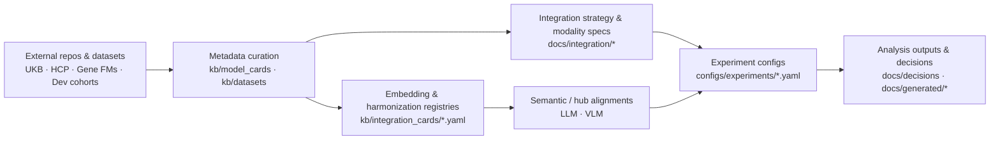

# 📖 Navigating the Neuro-Omics KB

> **Your guide to the knowledge base structure, YAML cards, and integration-critical metadata**

This page orients new readers to the structure of the knowledge base, how the YAML cards feed into the rendered docs, and where to find integration-critical metadata for **gene–brain–behaviour foundation models**.

---

## 🎯 Scope & Evolution

The KB began with **adult UK Biobank–centric gene–brain FM alignment** (genetics FM + MRI Brain FM outputs) and has expanded to include:

- ✅ **15 Model Cards**: 13 foundation models (4 genetics + 5 brain + 4 multimodal/clinical) + 2 ARPA-H planning cards
- ✅ **20 Research Papers**: Curated summaries with structured takeaways
- ✅ **Integration Guidance**: 6 YAML registries (embedding strategies, harmonization, preprocessing, alignment) + 3 narrative integration cards (ensemble integration, oncology review, multimodal FM patterns)
- ✅ **Developmental/Neurodevelopmental Support**: Longitudinal multimodal FMs spanning MRI/fMRI, EEG/EPhys, genetics, behavioral phenotypes
- ✅ **ARPA-H BOM Alignment**: Documentation for escalating from late fusion → contrastive → unified architectures

---

## 🏗️ Architecture at a Glance



- **Source repos / datasets** live under `external_repos/` (git-ignored) and upstream storage (UKB, HCP, Cha Hospital developmental cohorts, and future ARPA-H Brain-Omics Model (BOM) data sources).
- **Metadata cards** (`kb/**`) are the single source of truth for model/dataset specs, including adult and developmental gene–brain–behaviour datasets.
- **Docs pages** (this site) summarize how to use those cards for integration.
- **Strategy registries** (embedding/harmonization/preprocessing) connect raw exports to subject-level vectors.
- **Semantic alignment / hub registries** describe how modalities (gene, brain, EEG, behaviour) are aligned to **LLM** and **VLM** spaces in ARPA-H–style Brain-Omics Model (BOM) projects.
- **Experiment configs** log the exact recipe IDs and folds before any analysis job starts.

---

## 🗺️ Core Navigation Map

    
    **Foundation Models**
    
    - **Models → Genetics**: Caduceus, DNABERT-2, Evo2, GENERator — DNA sequence models with RC-equivariance
    - **Models → Brain**: BrainLM, Brain-JEPA, Brain Harmony, BrainMT, SwiFT — sMRI/fMRI neuroimaging models
    - **Models → Multimodal & Clinical**: BAGEL, MoT, M3FM, Me-LLaMA, TITAN, FMS-Medical — clinical/multimodal FMs
    
    **Integration & Strategy**
    
    - **Decisions → Integration plan (Nov 2025)**: Why we start with late fusion + CCA before escalating to Brain-Omics Model (BOM)
    - **Integration → Strategy**: Shared preprocessing doctrine and escalation triggers
    - **Integration → Integration cards**: Ensemble integration, oncology review, multimodal FM patterns
    - **Integration → Design patterns**: Late fusion, two-tower, MoT, BOM — reusable integration motifs
    - **Integration → Multimodal architectures**: Detailed architecture docs for BAGEL, MoT, M3FM, Me-LLaMA, TITAN
    - **Integration → Embedding policies**: Naming conventions and PCA dimensionality guidelines
    
    **Analysis & Workflows**
    
    - **Integration → Analysis recipes**: CCA+permutation, prediction baselines, partial correlations
    - **Integration → Modality features**: Genomics, sMRI, fMRI feature prep with embedding strategy IDs
    - **Code walkthroughs**: Step-by-step guides for all 15 FMs
    
    **Data & Metadata**
    
    - **Data**: UKB data map, schemas, subject keys, governance/QC logs
    - **KB Templates**: Model cards, dataset cards, integration cards, experiment configs
    - **Research Papers**: 18 curated paper summaries (genetics, brain, multimodal, integration methods)

## Metadata you must log per run

Use the CLI helpers to print the canonical recipes and copy their IDs into your run metadata:

```bash
# Embedding (e.g., FreeSurfer PCA-512)
python scripts/manage_kb.py ops strategy smri_free_surfer_pca512_v1

# Harmonization (e.g., MURD for T1/T2)
python scripts/manage_kb.py ops harmonization murd_t1_t2

# Preprocessing stack (e.g., HCP-like rs-fMRI)
python scripts/manage_kb.py ops strategy rsfmri_swift_segments_v1
```

Record:

1. `embedding_strategies.<id>` for every modality in the experiment.
2. `harmonization_methods.<id>` (even if it is `none_baseline`).
3. `rsfmri_preprocessing_pipelines.<id>` whenever an rs-fMRI FM is involved.
4. CV scheme (`StratifiedGroupKFold`, seed, groups) and manifest used.

## How content stays consistent

- **Template-first editing.** Every new card starts from the templates in `kb/templates/`.
- **Docs ↔ YAML parity.** If a doc cites a field (e.g., embedding recipe level), the corresponding YAML must include it.
- **Strict builds.** `mkdocs build --strict` guards against broken navigation before publishing.

## Suggested reading order

### For Researchers New to Foundation Models

1. **KB overview (this page)** — Understand the structure
2. **Models → Overview pages** — Browse [Genetics](../models/genetics/index.md), [Brain](../models/brain/index.md), or [Multimodal](../models/multimodal/index.md) overviews
3. **Integration → Strategy** — Learn the late-fusion-first philosophy
4. **Code walkthroughs** — Pick a model relevant to your modality
5. **Analysis recipes** — Copy-ready runbooks for CCA, prediction, etc.

### For Integration & Multimodal Work

1. **Integration → Design patterns** — Late fusion → contrastive → unified architectures
2. **Integration → Integration cards** — Study ensemble integration, oncology review, multimodal FM patterns
3. **Integration → Multimodal architectures** — Deep dive into BAGEL, MoT, M3FM, Me-LLaMA, TITAN
4. **Decisions → Integration plan (Nov 2025)** — See the escalation roadmap
5. **Integration → Embedding policies** — Learn naming conventions for strategies

### For Adding New Models or Cards

1. **KB Templates** — Start from templates in `kb/templates/` or `generated/templates/`
2. **Existing model cards** — Review `kb/model_cards/*.yaml` for patterns
3. **Docs ↔ YAML parity** — Ensure rendered docs cite fields that exist in YAML
4. **Validation** — Run `python scripts/manage_kb.py validate models` before committing

Use this map whenever you add new cards or plan analyses—it keeps the documentation, YAML metadata, and experiment configs aligned.

