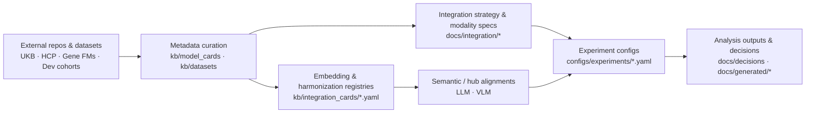

# Navigating the Neuro-Omics KB

This page orients new readers to the structure of the knowledge base, how the YAML cards feed into the rendered docs, and where to find integration-critical metadata for **gene–brain–behaviour foundation models**. The KB began with **adult UK Biobank–centric gene–brain FM alignment** (genetics FM + MRI Brain FM outputs) and now supports **developmental and neurodevelopmental longitudinal multimodal FMs** spanning MRI/fMRI Brain FMs, EEG/EPhys FMs, genetics / multi-omics FMs, and behavioural / developmental phenotypes.

## Architecture at a glance



- **Source repos / datasets** live under `external_repos/` (git-ignored) and upstream storage (UKB, HCP, Cha Hospital developmental cohorts, and future ARPA-H Brain-Omics Model (BOM) data sources).
- **Metadata cards** (`kb/**`) are the single source of truth for model/dataset specs, including adult and developmental gene–brain–behaviour datasets.
- **Docs pages** (this site) summarize how to use those cards for integration.
- **Strategy registries** (embedding/harmonization/preprocessing) connect raw exports to subject-level vectors.
- **Semantic alignment / hub registries** describe how modalities (gene, brain, EEG, behaviour) are aligned to **LLM** and **VLM** spaces in ARPA-H–style Brain-Omics Model (BOM) projects.
- **Experiment configs** log the exact recipe IDs and folds before any analysis job starts.

## Core navigation map

???+ info "Critical sections"
    - **Decisions → Integration plan (Nov 2025)**: why we start with late fusion + CCA before escalating to larger Brain-Omics Model (BOM) alignment.
    - **Integration → Strategy**: shared preprocessing doctrine and escalation triggers.
    - **Integration → Analysis recipes**: step-by-step guides for CCA, prediction baselines, partial correlations, and LOGO attribution.
    - **Integration → Modality features**: per-modality feature prep with links to the embedding strategy IDs (Genomics, sMRI, fMRI, and planned EEG / developmental behavioural specs).
    - **Models**: each FM’s walkthrough plus the YAML card referenced in `kb/model_cards/*.yaml` (genetic FMs, Brain FMs, and future EEG / Multi-Omics FMs).
    - **Data**: governance/QC logs and schema maps, including UKB and future developmental / neurodevelopmental cohorts.

## Metadata you must log per run

Use the CLI helpers to print the canonical recipes and copy their IDs into your run metadata:

```bash
# Embedding (e.g., FreeSurfer PCA-512)
python scripts/manage_kb.py ops strategy smri_free_surfer_pca512_v1

# Harmonization (e.g., MURD for T1/T2)
python scripts/manage_kb.py ops harmonization murd_t1_t2

# Preprocessing stack (e.g., HCP-like rs-fMRI)
python scripts/manage_kb.py ops strategy rsfmri_swift_segments_v1
```

Record:

1. `embedding_strategies.<id>` for every modality in the experiment.
2. `harmonization_methods.<id>` (even if it is `none_baseline`).
3. `rsfmri_preprocessing_pipelines.<id>` whenever an rs-fMRI FM is involved.
4. CV scheme (`StratifiedGroupKFold`, seed, groups) and manifest used.

## How content stays consistent

- **Template-first editing.** Every new card starts from the templates in `kb/templates/`.
- **Docs ↔ YAML parity.** If a doc cites a field (e.g., embedding recipe level), the corresponding YAML must include it.
- **Strict builds.** `mkdocs build --strict` guards against broken navigation before publishing.

## Suggested reading order

1. **KB overview (this page).**
2. **Integration strategy** for the big-picture method.
3. **Modality feature specs** for the modality you plan to touch.
4. **Relevant model walkthrough** under Code Walkthroughs.
5. **Experiment config** template that matches your goal (CCA, prediction, LOGO).

Use this map whenever you add new cards or plan analyses—it keeps the documentation, YAML metadata, and experiment configs aligned.

