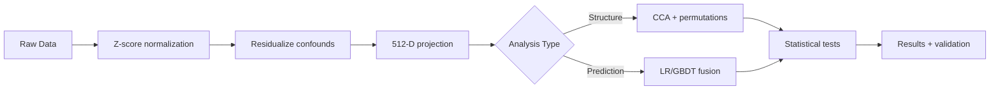

# 🧬🧠 Neuro-Omics Knowledge Base

[](https://allison-eunse.github.io/neuro-omics-kb/)
[](#foundation-models)
[](#research-papers)

> **A comprehensive documentation hub for genetics and brain foundation models and their multimodal integration.**

[📖 KB Overview](guide/kb_overview.md) | [🧬 Genetics Models](models/genetics/index.md) | [🧠 Brain Models](models/brain/index.md) | [🔗 Integration Guide](integration/integration_strategy.md) | [💻 GitHub](https://github.com/allison-eunse/neuro-omics-kb)

---

## 🎯 What is this?

A **documentation-first knowledge base** for researchers working with:

- 🧬 **Genetic foundation models** — Caduceus, DNABERT-2, Evo2, GENERator
- 🧠 **Brain imaging models** — BrainLM, Brain-JEPA, BrainMT, Brain Harmony, SwiFT
- 🏥 **Multimodal/Clinical models** — BAGEL, MoT, M3FM, Me-LLaMA, TITAN, FMS-Medical
- 🔗 **Integration strategies** — Gene-brain-behavior-language analysis

**Scope:** Documentation, metadata cards, and integration patterns — **not** model implementation code.

---

## 🚀 Quick Start

```bash
# 1. Clone and setup
git clone https://github.com/allison-eunse/neuro-omics-kb.git
cd neuro-omics-kb
python -m venv .venv && source .venv/bin/activate
pip install -r requirements.txt

# 2. View documentation locally
mkdocs serve  # Visit http://localhost:8000

# 3. Validate metadata cards
python scripts/manage_kb.py validate models
```

**New to foundation models?** → Start with:

1. 📖 [KB Overview](guide/kb_overview.md)
2. 🧬 [Genetics Models](models/genetics/index.md)
3. 🧠 [Brain Models](models/brain/index.md)
4. 🔗 [Integration Strategy](integration/integration_strategy.md)

---

## 💡 Use Cases

### → Genetics research
- Turn DNA sequences into strand-robust gene embeddings (Caduceus, DNABERT-2, Evo 2, GENERator)
- Compare variant effect predictors or run LOGO attribution with standardized configs
- Hand off vetted embeddings to integration pipelines without reimplementing data hygiene

**Go deeper:** [Explore Genetics Models](models/genetics/index.md)

### → Brain imaging
- Preprocess fMRI/sMRI cohorts, harmonize sites, and extract embeddings (BrainLM, Brain-JEPA, Brain Harmony, BrainMT, SwiFT)
- Control residualization/motion covariates before fusion experiments
- Swap projection heads or pooling strategies without touching raw scans

**Go deeper:** [Explore Brain Models](models/brain/index.md)

### → Multimodal integration
- Follow the late-fusion-first playbook (CCA + permutations, LR/GBDT fusion, contrastive escalation)
- Track embedding/processing provenance through integration cards and decision logs
- Plug in recipe-ready configs for CCA, prediction baselines, or partial correlations

**Go deeper:** [Explore Integration Strategy](integration/integration_strategy.md)

### → Clinical & multimodal FMs
- Reuse BAGEL, MoT, M3FM, Me-LLaMA, TITAN, and FMS-Medical walkthroughs as reference builds
- Understand how vision–language or sparse MoE systems align modalities before adapting to neuro-omics
- Borrow evaluation scaffolding for bilingual or imaging–text setups

**Go deeper:** [Explore Multimodal Models](models/multimodal/index.md)

### → Reproducible research guardrails
- Start from vetted configs (`configs/experiments/*`) with stratified CV and QC baked in
- Run codified validation steps (`scripts/manage_kb.py`, `codex_gate.py`) before sharing outputs
- Use analysis recipes as living SOPs for cohorts, baselines, and integration checkpoints

**Go deeper:** [Explore Analysis Recipes](integration/analysis_recipes/cca_permutation.md)

---

## 📦 What's Inside

<details open>
<summary><b>📚 Documentation</b> — Walkthroughs, playbooks, decision logs</summary>

```
docs/
├── code_walkthroughs/          ← 15 guided FM tours
│   ├── 🧬 Genetics (4):  Caduceus, DNABERT-2, Evo 2, GENERator
│   ├── 🧠 Brain (5):     BrainLM, Brain-JEPA, Brain Harmony, BrainMT, SwiFT
│   └── 🏥 Multimodal (6): BAGEL, MoT, M3FM, Me-LLaMA, TITAN, FMS-Medical
├── integration/                ← Fusion strategies, design patterns, benchmarks
├── data/                       ← UKB data map, QC protocols, schemas
├── decisions/                  ← Integration plans, validation rationale
└── generated/kb_curated/       ← AI-curated PDFs + Markdown summaries
```

Walkthroughs, schemas, and decision logs share the same terminology across genetics, brain, and multimodal FMs.

</details>

<details>
<summary><b>🏷️ Metadata Cards</b> — Structured YAML for all assets</summary>

```
kb/
├── model_cards/          ← 15 FM specs (13 FMs + 2 ARPA-H planning)
├── paper_cards/          ← 20 research papers with structured takeaways
├── datasets/             ← Sample sizes, QC thresholds, access requirements
└── integration_cards/    ← Embeddings, harmonization, preprocessing pipelines
```

[Browse all cards on GitHub →](https://github.com/allison-eunse/neuro-omics-kb/tree/main/kb)

</details>

<details>
<summary><b>🔧 Tools & Scripts</b> — Validation, quality gates, sync</summary>

```
scripts/
├── manage_kb.py             ← Validate YAML, query embeddings/harmonization
├── codex_gate.py            ← Pre-commit quality sweeps
└── fetch_external_repos.sh  ← Sync upstream FM repos
```

Pair these with `verify_kb.sh` or `mkdocs serve` during review cycles.

</details>

<details>
<summary><b>⚙️ Experiment Configs</b> — Ready-to-run templates</summary>

```
configs/experiments/
├── 01_cca_gene_smri.yaml          ← CCA + permutation baseline
├── 02_prediction_baselines.yaml   ← Gene vs Brain vs Fusion (LR/GBDT)
├── 03_logo_gene_attribution.yaml  ← Leave-one-gene-out ΔAUC
└── dev_* templates                ← CHA cohort dev stubs
```

Each config references the exact embeddings, covariates, and validation plan to keep runs reproducible.

</details>

---

<a id="foundation-models"></a>

## 🎯 Foundation Model Registry

### Genetics Models
| Model | Best for | Context | Walkthrough |
|-------|----------|---------|-------------|
| 🧬 [Caduceus](models/genetics/caduceus.md) | RC-equivariant gene embeddings | DNA sequences | [Code walkthrough](code_walkthroughs/caduceus_walkthrough.md) |
| 🧬 [DNABERT-2](models/genetics/dnabert2.md) | Cross-species transfer | BPE tokenization | [Code walkthrough](code_walkthroughs/dnabert2_walkthrough.md) |
| 🧬 [Evo 2](models/genetics/evo2.md) | Ultra-long regulatory regions | 1M context | [Code walkthrough](code_walkthroughs/evo2_walkthrough.md) |
| 🧬 [GENERator](models/genetics/generator.md) | Generative modeling | 6-mer LM | [Code walkthrough](code_walkthroughs/generator_walkthrough.md) |

### Brain Models
| Model | Modality | Best for | Walkthrough |
|-------|----------|----------|-------------|
| 🧠 [BrainLM](models/brain/brainlm.md) | fMRI | Site-robust embeddings | [Code walkthrough](code_walkthroughs/brainlm_walkthrough.md) |
| 🧠 [Brain-JEPA](models/brain/brainjepa.md) | fMRI | Lower-latency option | [Code walkthrough](code_walkthroughs/brainjepa_walkthrough.md) |
| 🧠 [Brain Harmony](models/brain/brainharmony.md) | sMRI + fMRI | Multi-modal fusion | [Code walkthrough](code_walkthroughs/brainharmony_walkthrough.md) |
| 🧠 [BrainMT](models/brain/brainmt.md) | sMRI/fMRI | Mamba efficiency | [Code walkthrough](code_walkthroughs/brainmt_walkthrough.md) |
| 🧠 [SwiFT](models/brain/swift.md) | fMRI | Hierarchical spatiotemporal | [Code walkthrough](code_walkthroughs/swift_walkthrough.md) |

### Multimodal & Clinical Models
| Model | Type | Key Innovation | Walkthrough |
|-------|------|----------------|-------------|
| 🔗 [BAGEL](models/multimodal/bagel.md) | Unified FM | MoT experts (understanding + generation) | [Code walkthrough](code_walkthroughs/bagel_walkthrough.md) |
| 🔗 [MoT](models/multimodal/mot.md) | Sparse transformer | Modality-aware sparsity (~55% FLOPs) | [Code walkthrough](code_walkthroughs/mot_walkthrough.md) |
| 🏥 [M3FM](models/multimodal/m3fm.md) | Radiology | CXR/CT + bilingual reports (EN/CN) | [Code walkthrough](code_walkthroughs/m3fm_walkthrough.md) |
| 🏥 [Me-LLaMA](models/multimodal/me_llama.md) | Medical LLM | Continual pretrained LLaMA (129B tokens) | [Code walkthrough](code_walkthroughs/melamma_walkthrough.md) |
| 🏥 [TITAN](models/multimodal/titan.md) | Pathology | Gigapixel whole-slide imaging | [Code walkthrough](code_walkthroughs/titan_walkthrough.md) |

📖 [Explore Multimodal Models Overview](models/multimodal/index.md) • [Multimodal Architectures Guide](integration/multimodal_architectures.md) • [Design Patterns](integration/design_patterns.md)

---

<a id="integration-strategies"></a>

## 🔗 Integration Stack

**→ Core Strategy:** [Integration Strategy](integration/integration_strategy.md)  
**→ Analysis Recipes:** [CCA + permutation](integration/analysis_recipes/cca_permutation.md) · [Prediction baselines](integration/analysis_recipes/prediction_baselines.md) · [Partial correlations](integration/analysis_recipes/partial_correlations.md)  
**→ Modality Features:** [Genomics](integration/modality_features/genomics.md) · [sMRI](integration/modality_features/smri.md) · [fMRI](integration/modality_features/fmri.md)  
**→ Design Patterns:** [Design patterns](integration/design_patterns.md) · [Multimodal architectures](integration/multimodal_architectures.md)

**Integration Roadmap:**

```
🔵 Late Fusion (baseline)
       ↓ If fusion wins significantly
🟢 Two-Tower Contrastive
       ↓ If gains plateau
🟡 EI Stacking / Hub Tokens
       ↓ Last resort
🔴 Full Early Fusion (TAPE-style)
```

**Decisions:** [Integration baseline plan (Nov 2025)](decisions/2025-11-integration-plan.md)

---

<a id="research-papers"></a>

## 📋 Research Papers

**Every paper has three quick links:** KB summary (MD) · Annotated PDF · Original publication  
[→ Full Paper Asset Index](generated/kb_curated/README.md#original-source-index)

### 🧬 Genetics Foundation Models
| Paper | MD notes | PDF notes | Source | Focus |
|-------|----------|-----------|--------|-------|
| 🧬 [Caduceus](models/genetics/caduceus.md) | [MD notes](generated/kb_curated/papers-md/caduceus_2024.md) | [PDF notes](generated/kb_curated/papers-pdf/caduceus_2024.pdf) | [arXiv:2403.03234](https://arxiv.org/abs/2403.03234) | RC-equivariant BiMamba DNA FM |
| 🧬 [DNABERT-2](models/genetics/dnabert2.md) | [MD notes](generated/kb_curated/papers-md/dnabert2_2024.md) | [PDF notes](generated/kb_curated/papers-pdf/dnabert2_2024.pdf) | [arXiv:2306.15006](https://arxiv.org/abs/2306.15006) | BPE-tokenized multi-species encoder |
| 🧬 [Evo 2](models/genetics/evo2.md) | [MD notes](generated/kb_curated/papers-md/evo2_2024.md) | [PDF notes](generated/kb_curated/papers-pdf/evo2_2024.pdf) | [bioRxiv 2025.02.18](https://www.biorxiv.org/content/10.1101/2025.02.18.638918v1) | StripedHyena 1M-token model |
| 🧬 [GENERator](models/genetics/generator.md) | [MD notes](generated/kb_curated/papers-md/generator_2024.md) | [PDF notes](generated/kb_curated/papers-pdf/generator_2024.pdf) | [arXiv:2502.07272](https://arxiv.org/abs/2502.07272) | Generative 6-mer DNA LM |

### 🧠 Brain Foundation Models
| Paper | MD notes | PDF notes | Source | Focus |
|-------|----------|-----------|--------|-------|
| 🧠 [BrainLM](models/brain/brainlm.md) | [MD notes](generated/kb_curated/papers-md/brainlm_2024.md) | [PDF notes](generated/kb_curated/papers-pdf/brainlm_2024.pdf) | [OpenReview RwI7ZEfR27](https://openreview.net/forum?id=RwI7ZEfR27) | ViT-MAE for UKB fMRI |
| 🧠 [Brain-JEPA](models/brain/brainjepa.md) | [MD notes](generated/kb_curated/papers-md/brainjepa_2024.md) | [PDF notes](generated/kb_curated/papers-pdf/brainjepa_2024.pdf) | [arXiv:2409.19407](https://arxiv.org/abs/2409.19407) | Joint-embedding prediction |
| 🧠 [Brain Harmony](models/brain/brainharmony.md) | [MD notes](generated/kb_curated/papers-md/brainharmony_2025.md) | [PDF notes](generated/kb_curated/papers-pdf/brainharmony_2025.pdf) | [arXiv:2509.24693](https://arxiv.org/abs/2509.24693) | sMRI+fMRI fusion with TAPE |
| 🧠 [BrainMT](models/brain/brainmt.md) | [MD notes](generated/kb_curated/papers-md/brainmt_2025.md) | [PDF notes](generated/kb_curated/papers-pdf/brainmt_2025.pdf) | [LNCS 10.1007/…-2_15](https://dl.acm.org/doi/10.1007/978-3-032-05162-2_15) | Hybrid Mamba-Transformer |
| 🧠 [SwiFT](models/brain/swift.md) | [MD notes](generated/kb_curated/papers-md/swift_2023.md) | [PDF notes](generated/kb_curated/papers-pdf/swift_2023.pdf) | [arXiv:2307.05916](https://arxiv.org/abs/2307.05916) | Swin-style 4D fMRI |

### 🏥 Multimodal & Clinical Foundation Models
| Paper | MD notes | PDF notes | Source | Focus |
|-------|----------|-----------|--------|-------|
| 🔗 [BAGEL](models/multimodal/bagel.md) | [MD notes](generated/kb_curated/papers-md/bagel_2025.md) | [PDF notes](generated/kb_curated/papers-pdf/bagel_2025.pdf) | [arXiv:2505.14683](https://arxiv.org/abs/2505.14683) | Unified MoT decoder |
| 🔗 [MoT](models/multimodal/mot.md) | [MD notes](generated/kb_curated/papers-md/mot_2025.md) | [PDF notes](generated/kb_curated/papers-pdf/mot_2025.pdf) | [arXiv:2411.04996](https://arxiv.org/abs/2411.04996) | Modality-aware sparse transformers |
| 🏥 [M3FM](models/multimodal/m3fm.md) | [MD notes](generated/kb_curated/papers-md/m3fm_2025.md) | [PDF notes](generated/kb_curated/papers-pdf/m3fm_2025.pdf) | [npj Digital Medicine 2025](https://www.nature.com/articles/s41746-024-01339-7) | Multilingual medical vision-language |
| 🏥 [Me-LLaMA](models/multimodal/me_llama.md) | [MD notes](generated/kb_curated/papers-md/me_llama_2024.md) | [PDF notes](generated/kb_curated/papers-pdf/me_llama_2024.pdf) | [arXiv:2404.05416](https://arxiv.org/abs/2404.05416) | Medical LLM continual-pretraining |
| 🏥 [TITAN](models/multimodal/titan.md) | [MD notes](generated/kb_curated/papers-md/titan_2025.md) | [PDF notes](generated/kb_curated/papers-pdf/titan_2025.pdf) | [Nature Medicine 2025](https://www.nature.com/articles/s41591-024-03235-7) | Gigapixel whole-slide pathology |
| 📚 [MM FMs Survey](integration/multimodal_architectures.md) | [MD notes](generated/kb_curated/papers-md/mmfm_2025.md) | [PDF notes](generated/kb_curated/papers-pdf/mmfm_2025.pdf) | [AI in Medicine 2025](https://www.sciencedirect.com/science/article/pii/S0933365725002003) | Clinical MM FM patterns |

### 🔗 Integration & Methods
| Paper | MD notes | PDF notes | Source | Focus |
|-------|----------|-----------|--------|-------|
| 📊 [Ensemble Integration](models/integrations/ensemble_integration.md) | [MD notes](generated/kb_curated/papers-md/ensemble_integration_li2022.md) | [PDF notes](generated/kb_curated/papers-pdf/ensemble_integration_li2022.pdf) | [doi:10.1093/bioadv/vbac065](https://doi.org/10.1093/bioadv/vbac065) | Late-fusion rationale |
| 🧪 [Oncology Multimodal](generated/kb_curated/papers-md/oncology_multimodal_waqas2024.md) | [MD notes](generated/kb_curated/papers-md/oncology_multimodal_waqas2024.md) | [PDF notes](generated/kb_curated/papers-pdf/oncology_multimodal_waqas2024.pdf) | [PubMed 39118787](https://pubmed.ncbi.nlm.nih.gov/39118787/) | Confounds & protocols |
| 🧠 [Yoon BIOKDD 2025](generated/kb_curated/papers-md/yoon_biokdd2025.md) | [MD notes](generated/kb_curated/papers-md/yoon_biokdd2025.md) | [PDF notes](generated/kb_curated/papers-pdf/yoon_biokdd2025.pdf) | [bioRxiv 2025.02.18](https://www.biorxiv.org/content/10.1101/2025.02.18.638918v1.full.pdf) | LOGO attribution |
| 🌍 [GWAS Diverse Populations](generated/kb_curated/papers-md/gwas_diverse_populations.md) | [MD notes](generated/kb_curated/papers-md/gwas_diverse_populations.md) | [PDF notes](generated/kb_curated/papers-pdf/gwas_diverse_populations.pdf) | [PubMed 36158455](https://pubmed.ncbi.nlm.nih.gov/36158455/) | Ancestry-aware QC |
| 📈 [PRS Guide](generated/kb_curated/papers-md/prs_guide.md) | [MD notes](generated/kb_curated/papers-md/prs_guide.md) | [PDF notes](generated/kb_curated/papers-pdf/prs_guide.pdf) | [PubMed 31607513](https://pubmed.ncbi.nlm.nih.gov/31607513/) | Polygenic risk reporting |

---

## 📊 Data & Schemas

| Resource | Description | Link |
|----------|-------------|------|
| 🏥 **UKB Data Map** | Field mappings, cohort definitions | [View](data/ukb_data_map.md) |
| ✅ **Governance & QC** | Quality control protocols, IRB guidelines | [View](data/governance_qc.md) |
| 🔑 **Subject Keys** | ID management and anonymization | [View](data/subject_keys.md) |
| 📋 **Schemas** | Data format specifications | [View](data/schemas.md) |
| 📦 **FMS-Medical Catalog** | 100+ medical FM references | [View](models/multimodal/fms_medical.md) |

---

## 🗂️ KB Assets

<div class="grid cards" markdown>

-   :material-file-document: **Model Cards**

    ---

    15 model cards: 13 foundation models + 2 ARPA-H planning cards

    [Browse on GitHub](https://github.com/allison-eunse/neuro-omics-kb/tree/main/kb/model_cards)

-   :material-book-open-page-variant: **Paper Cards**

    ---

    Structured summaries of 20 key papers with integration hooks

    [Browse on GitHub](https://github.com/allison-eunse/neuro-omics-kb/tree/main/kb/paper_cards)

-   :material-database: **Dataset Cards**

    ---

    Data source specifications for UKB, HCP, and benchmarks

    [Browse on GitHub](https://github.com/allison-eunse/neuro-omics-kb/tree/main/kb/datasets)

-   :material-link-variant: **Integration Cards**

    ---

    Cross-modal fusion patterns and actionable guidance

    [Browse on GitHub](https://github.com/allison-eunse/neuro-omics-kb/tree/main/kb/integration_cards)

</div>

---

## ⚙️ Experiment Configs

Ready-to-use analysis templates with validation schemas:

| Template | Purpose | Key Features |
|----------|---------|--------------|
| 📊 **01_cca_gene_smri** | CCA + permutation baseline | Cross-modal null distributions, p-values |
| 🎯 **02_prediction_baselines** | Gene vs Brain vs Fusion | LR/GBDT comparison, DeLong tests |
| 🧬 **03_logo_gene_attribution** | LOGO ΔAUC protocol | Leave-one-gene-out attribution |

[→ Explore Experiment Configs](configs/experiments.md)

---

## 🚀 Standard Pipeline



!!! warning "Always Residualize"
    **Confounds to control:**
    - Age, sex, site/scanner
    - Motion (mean FD for fMRI)
    - SES, genetic PCs
    - Batch effects

!!! tip "Start with CCA + Permutation"
    CCA always returns non-zero correlations, even on shuffled data. The permutation test builds a **null distribution** by re-fitting after within-fold shuffling, giving you p-values to avoid over-interpreting noise—critical when sites share confounds.

---

## 🛠️ Typical Workflow

1. **📖 Explore** — Browse model cards and paper summaries
2. **🔍 Select** — Choose appropriate FMs for your modalities
3. **⚙️ Configure** — Clone experiment config template
4. **▶️ Run** — Extract embeddings and run analysis
5. **✅ Validate** — Use quality gates (`manage_kb.py`)
6. **📝 Document** — Log results back to KB

**Need help?** Check the [KB Overview](guide/kb_overview.md) or explore [Code Walkthroughs](code_walkthroughs/index.md)
